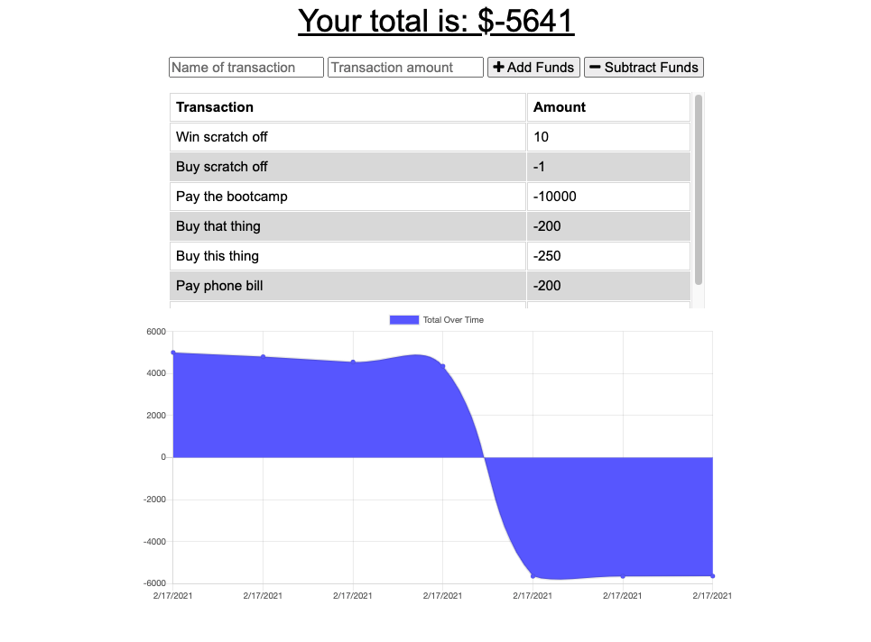

# budget-tracker

## _Description_

This application assist the user by tracking their budget. With the easy to use functionality, all the user has to do is enter the name of their transaction - as well as the amount. Then buy clicking "add funds" will result in an increase to their total or "subtract" which will decrease the total. A dynamic graph measures their transactions as well displays all previous transactions. 

In the event that the user loses internet connection - FEAR NOT - their data is safely stored inside IndexedDB pending, once the user is reconnected the pending data is extracted from IndexedDB. 

## _Technologies_

## _Usage_

The application can be viewed from here:

> https://aqueous-thicket-74160.herokuapp.com//

## _Author Info_

> Email: joselarojr@gmail.com

- GitHub User: JRLaro

  

## _Credits // License_

No collaborators were harmed in the making of this application

> MIT License
> Copyright (©) 2020, J.Laro

Permission is hereby granted, free of charge, to any person obtaining a copy of this software and associated documentation files (the "Software"), to deal in the Software without restriction, including without limitation the rights to use, copy, modify, merge, publish, distribute, sublicense, and/or sell copies of the Software, and to permit persons to whom the Software is furnished to do so, subject to the following conditions:

The above copyright notice and this permission notice shall be included in all copies or substantial portions of the Software.

THE SOFTWARE IS PROVIDED "AS IS", WITHOUT WARRANTY OF ANY KIND, EXPRESS OR IMPLIED, INCLUDING BUT NOT LIMITED TO THE WARRANTIES OF MERCHANTABILITY, FITNESS FOR A PARTICULAR PURPOSE AND NONINFRINGEMENT. IN NO EVENT SHALL THE AUTHORS OR COPYRIGHT HOLDERS BE LIABLE FOR ANY CLAIM, DAMAGES OR OTHER LIABILITY, WHETHER IN AN ACTION OF CONTRACT, TORT OR OTHERWISE, ARISING FROM, OUT OF OR IN CONNECTION WITH THE SOFTWARE OR THE USE OR OTHER DEALINGS IN THE SOFTWARE.